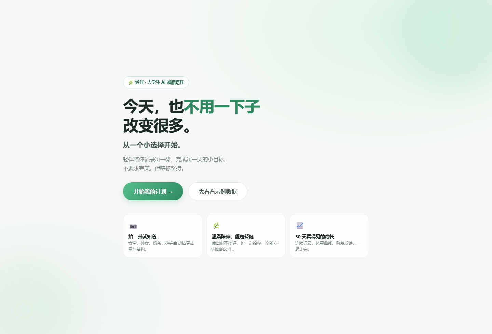
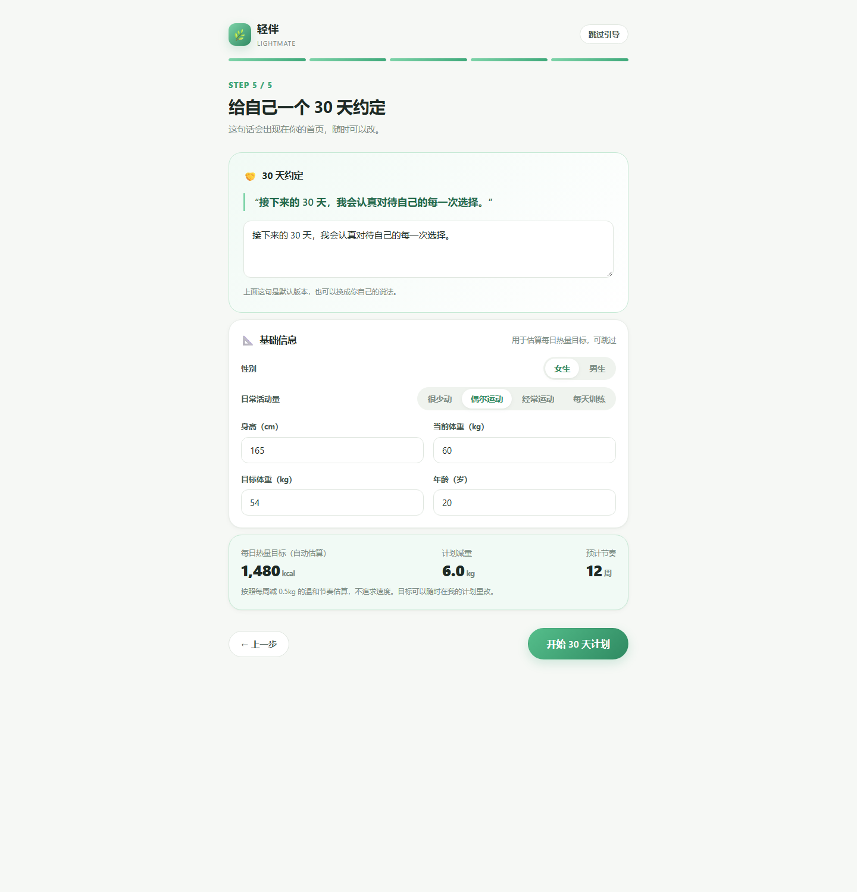
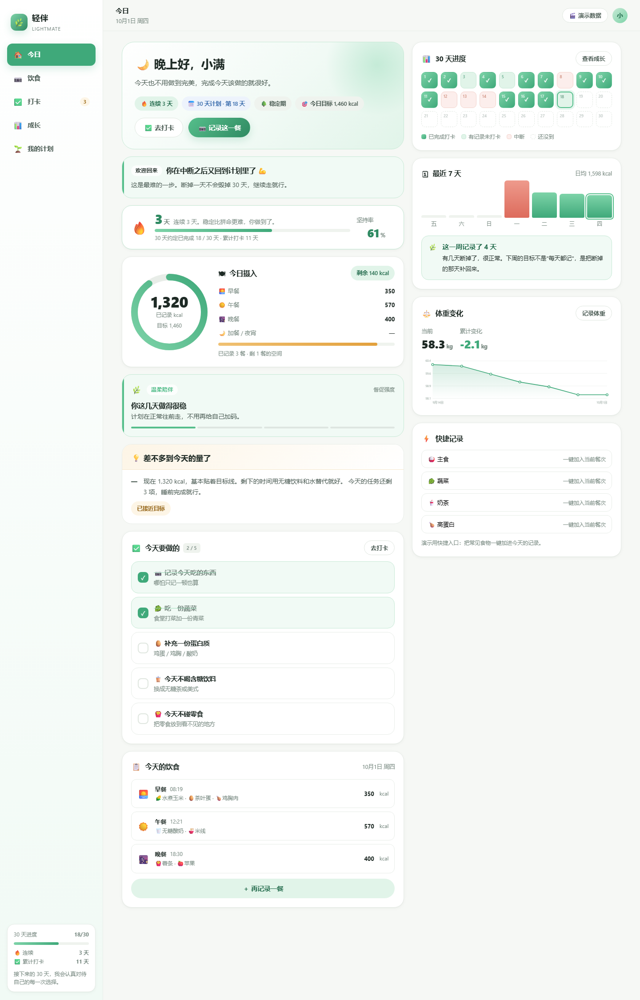
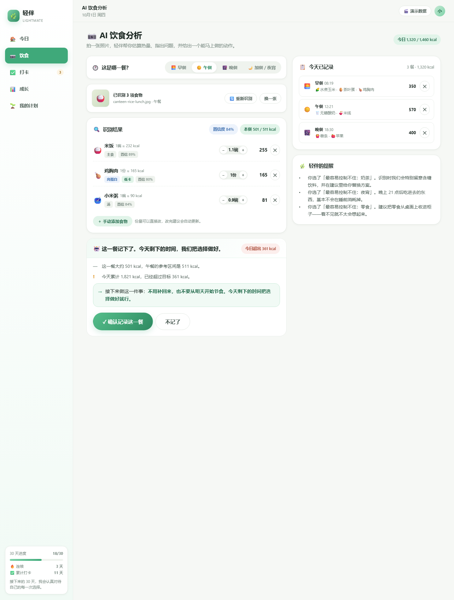
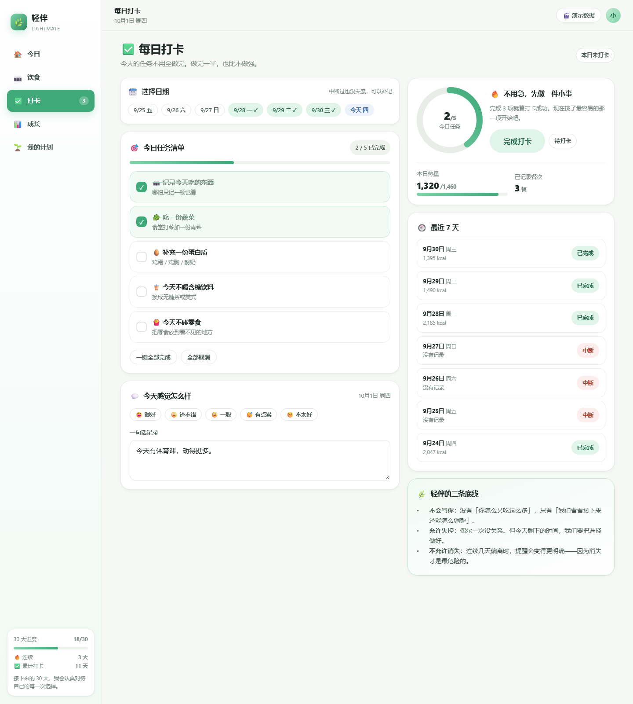
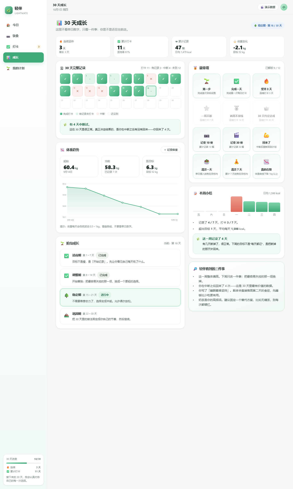
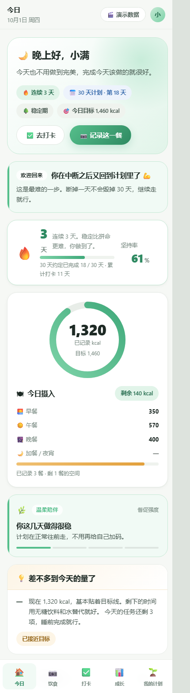

# 轻伴 LightMate · 大学生 AI 减脂陪伴 Web Demo

> 产品核心：**温柔陪伴，坚定督促**
> 当前阶段：Web Demo / MVP
> 交付形态：零依赖静态网页（双击即开，不需要构建、不需要联网、不需要后端）

---

## 一、快速开始

### 方式 1：直接双击（最快）

用浏览器打开 `index.html` 即可。

### 方式 2：本地服务器（更稳，推荐演示时使用）

```bash
node serve.js          # 默认 http://localhost:5173/
node serve.js 8080     # 指定端口
```

### 30 秒看懂这个 Demo

1. 打开首页 → 点 **「先看看示例数据」**，会立刻生成 18 天的完整使用历史（包含一次 3 天中断）。
2. 进入 **🏠 今日**：看连续坚持、热量环、动态督促状态与失败恢复卡片。
3. 进入 **📷 饮食**：选「🍚 食堂」示例图 → 「开始 AI 识别」→ 看识别结果、热量估算与建议。
4. 进入 **✅ 打卡**：勾任务、写一句话、完成打卡；把日期切到中断的那一天可以 **补记**。
5. 进入 **📊 成长**：30 天热力图、体重曲线、徽章墙、阶段成长。
6. 进入 **🌱 我的计划**：改目标、改提醒方式、改热量目标、重新开始 30 天。

> 演示快捷键：在非输入状态下按 `1`～`5` 可直接切换五个页面。

### 在线访问

部署到 GitHub Pages 后可直接通过网址访问：

- 🆕 **完全没建过仓库？看 [GITHUB-GUIDE.md](GITHUB-GUIDE.md)** —— 从注册账号到网页上线的保姆级全教程
- 已经熟悉 GitHub？看 [DEPLOY.md](DEPLOY.md) —— 一键部署脚本与配置说明

本地预览：

```bash
node serve.js        # http://localhost:5173/
```

---

## 界面预览

| 欢迎页 | 首次目标设置 |
|---|---|
|  |  |

| 今日 Dashboard | AI 饮食分析 |
|---|---|
|  |  |

| 每日打卡 | 30 天成长 |
|---|---|
|  |  |

移动端（390px 视口）：



> 以上截图由 `_dev/shot.html` 与 `_dev/mobile.html` 用无头浏览器自动生成。

---

## 二、目录结构

```
lightmate/
├── index.html                   入口页面
├── serve.js                     零依赖本地静态服务器（可选）
├── assets/
│   ├── css/style.css            设计系统（颜色/圆角/组件/响应式，约 900 行）
│   └── js/
│       ├── data.js              食物库（62 种大学生常见食物）、文案库、徽章、阶段
│       ├── util.js              DOM / 日期 / 环形图 / 折线图 / Toast / Modal
│       ├── store.js             状态层：持久化、派生指标、动态督促引擎、演示数据
│       ├── advice.js            AI 分析层：饮食识别（模拟）、建议生成、周报
│       ├── views/
│       │   ├── onboarding.js    欢迎页 + 5 步首次目标设置
│       │   ├── dashboard.js     首页 Dashboard
│       │   ├── diet.js          AI 饮食分析
│       │   ├── checkin.js       每日打卡 + 补记 / 失败恢复
│       │   ├── growth.js        30 天成长记录
│       │   └── plan.js          我的计划 + 数据管理
│       └── app.js               路由与骨架
└── _dev/                        开发期测试资产（非产品代码，可删除）
    ├── smoke.html               无头冒烟测试（68 项断言）
    ├── shot.html / mobile.html  截图与移动端视口测试页
    └── shots/                   各页面验收截图
```

---

## 三、P0 功能实现情况（对照需求文档）

| # | P0 功能 | 实现位置 | 说明 |
|---|---|---|---|
| 1 | 首次目标设置 | `views/onboarding.js` | 严格 5 步：目标 → 最容易失控 → 最难坚持 → 提醒方式 → 30 天约定；身体信息放在第 5 步，可跳过 |
| 2 | 首页 Dashboard | `views/dashboard.js` | 分时段问候、连续坚持、热量环、今日任务、今日饮食、30 天进度、周报、体重 |
| 3 | AI 饮食拍照/图片上传 | `views/diet.js` | 点击上传 / 拖拽 / 5 张示例图；图片只在本机读取，不上传 |
| 4 | AI 热量估算 Demo | `advice.js: recognize()` | 文件名关键词 + 餐次合理性 + 用户痛点加权；带 4 步分析动画与置信度 |
| 5 | AI 饮食建议 | `advice.js: analyzeMeal()` | 先说事实 → 再指出问题 → 最后给一个能立刻做的动作 |
| 6 | 每日任务打卡 | `views/checkin.js` | 任务由用户痛点自动生成（4～5 项）；过半即可打卡，不要求全做完 |
| 7 | 连续坚持记录 | `store.js: stats()` | 当前连续、历史最长、坚持率；今天未打卡不算断 |
| 8 | 30 天成长记录 | `views/growth.js` | 30 格热力图、体重曲线、徽章墙（12 枚）、四阶段成长、本周小结 |
| 9 | 动态督促状态 | `store.js: nudge()` | 4 级强度：温柔陪伴 → 温柔提醒 → 明确督促 → 坚定干预 |
| 10 | 失败恢复机制 | `dashboard.js: recoveryCard()`、`checkin.js` | 断档次日出现恢复引导；允许补记；回归后给明确肯定 |

### 产品四原则的落地方式

| 原则 | 代码里的体现 |
|---|---|
| 不批评，但指出问题 | 建议文案只有事实与影响，禁用词由冒烟测试断言拦截（如「你太不自律」） |
| 不要求完美，但要求行动 | `analyzeMeal()` 的返回值保证 `action` 一定非空；打卡只需完成一半任务 |
| 允许偶尔失败，不允许持续放纵 | `isDeviant()` 判定单日偏离，`nudge()` 按**连续**偏离天数升级强度 |
| 温柔陪伴，坚定督促 | 人格固定；「提醒方式」只调节频率与强度上限，不改变说话方式 |

### 动态督促引擎规则

```
偏离判定：过去的某一天，完全没记录 或 摄入 > 目标的 115%
强度计算（从昨天往前数连续偏离天数 run）：
  run ≥ 3                    → 🔔 坚定干预
  run = 2，或今天已超标      → ⚡ 明确督促
  run = 1，或近 3 天偏离 ≥2  → 🍃 温柔提醒
  其余                       → 🌿 温柔陪伴
提醒方式 = 轻提醒时，强度上限压到「温柔提醒」；计划开始前的日子不计入判定。
```

---

## 四、关键实现说明

### 数据与隐私

- 全部状态存在浏览器 `localStorage`（key：`lightmate.state.v1`），**不上传、不联网、无后端**。
- 首页与「我的计划」都可导出 / 导入 JSON，可一键载入演示数据或清空。

### 热量目标怎么算

Mifflin-St Jeor 公式 → 乘活动系数 → 减去 400 kcal 温和缺口 → 不低于安全下限（女 1200 / 男 1500）。
用户可随时手动覆盖，「我的计划」里同时显示自动估算值供对照。

### 饮食识别是"模拟"的（Demo 边界）

没有调用真实视觉模型，但做到了三点：

1. **可复现**：同样的图片 + 同样的种子 → 同样结果（基于 `mulberry32` 伪随机）。
2. **贴合场景**：按餐次过滤候选池，一顿饭最多 1 份主食、1 份甜点；命中用户「最容易失控」的项时优先出现。
3. **可修正**：识别结果可改份量、可删除、可手动补食物，改完建议实时更新。

接真实模型时，只需把 `advice.js: recognize()` 换成一次网络请求，返回同样的
`{ items, total, confidence }` 结构，其余页面无需改动。

### 响应式

- ≥ 1080px：左侧导航 + 双栏内容
- 860～1080px：单栏堆叠
- < 860px：隐藏侧边栏，底部 Tab 栏导航（已在 390px 视口验证无横向溢出）

---

## 五、测试

`_dev/smoke.html` 是一个无头冒烟测试页，覆盖 **68 项断言**：数据层、派生指标、督促引擎、
识别与建议、失败恢复、路由渲染、导出导入、完整业务闭环，并对建议文案做**禁用词检查**。

```bash
# 用 Edge / Chrome 无头运行，读取 <pre id="report"> 的结果
msedge --headless=new --disable-gpu --virtual-time-budget=15000 \
       --dump-dom "file:///<绝对路径>/lightmate/_dev/smoke.html"
```

最近一次结果：**68 项断言全部通过，0 个运行时错误**。

开发过程中被测试与截图抓出并修复的真实缺陷：

1. `analyzeMeal()` 返回了 `actions` 数组却漏了 `action` 字段 → 饮食页会显示 "undefined" 的行动建议。
2. 路由名 `today` 与视图注册名 `dashboard` 不一致 → 首页内容区整块空白（冒烟测试当时直接调视图，绕过了路由器，后来补充了「真实路由渲染」断言）。
3. 新用户的计划开始日之前的日子被误判为「连续偏离」→ 首次进入就会被判成「坚定干预」。
4. 渲染用 `requestAnimationFrame` 做合并，标志位在后台/无头环境下会卡死，导致后续所有渲染被静默丢弃 → 改为同步可重入渲染。
5. 识别结果把三道主食塞进同一餐、宵夜照片里出现盖浇饭 → 加入餐次合理性过滤与组餐约束。

随手可复现的界面验收截图在 `_dev/shots/`。

---

## 六、已知边界与后续规划

**当前（Demo）**
- 无账号体系，数据仅存在本机浏览器。
- 无消息推送通道，「提醒」以页面内的督促状态呈现。
- 饮食识别为本地模拟，未接真实视觉模型。

**下一步优先级**
1. 接入真实视觉模型（保持 `recognize()` 的出参结构不变）。
2. 微信小程序 / PWA：把浏览器通知换成真正的定时提醒。
3. 食堂菜品库共建：让「食堂这顿饭热量高不高」这一问真正可答。
4. 社交压力场景的专项训练：奶茶局、聚餐局的**事前**干预话术。
5. 周报 / 月报的可分享卡片，作为低成本传播与留存钩子。

---

## 七、需求文档中未覆盖到的部分（本次按合理默认实现）

原始需求在「页面三：首页 Dashboard」的「连续记…」处截断。以下内容未在文档中给出，
本次按产品逻辑补齐，后续可按正式稿替换：

- 首页的 30 天进度网格、本周小结柱状图、体重趋势卡、快捷记录入口。
- 页面四～七（AI 饮食分析、每日打卡、成长记录、我的计划）的完整信息架构。
- 5 步引导中身体信息（身高/体重/目标体重/活动量）的采集位置——放在第 5 步且可跳过，
  因为热量目标需要它，但不该成为开始使用的门槛。
